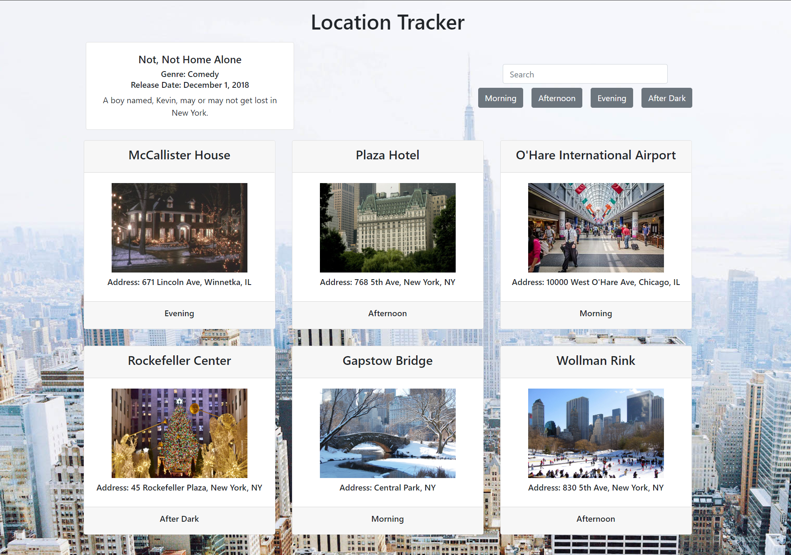

# Movie Location Tracker

### Description
The purpose of this  homework assingment was to introduce us to jQuery. The basic functionality of searching and filtering items are not new. However, using jQuery to search and filter through items was new.

### Technologies Used
* HTML
* CSS
* JavaScript
* Bootstrap
* jQuery

### Screenshots


### How to run application

* Use npm to install http-server in your terminal:
```sh
npm install -g http-server
```
* Run the server in your terminal
```sh
hs -p 9999
```
* Open chrome and navigate to:
```
localhost:9999
```

### Contributors
[Maggie Leavell](https://github.com/mjleavell)