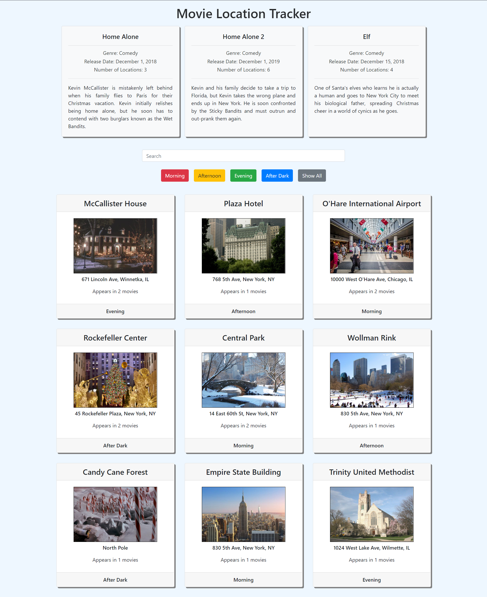
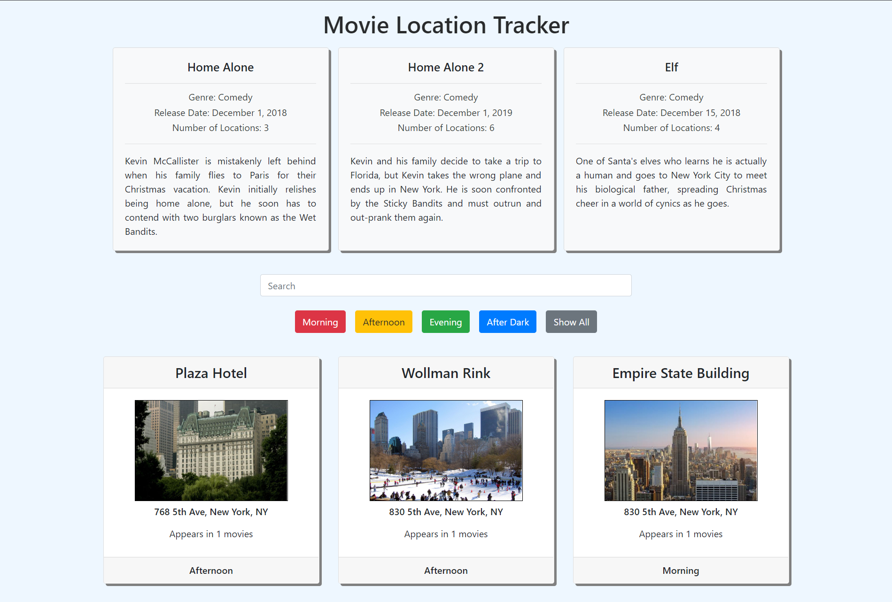
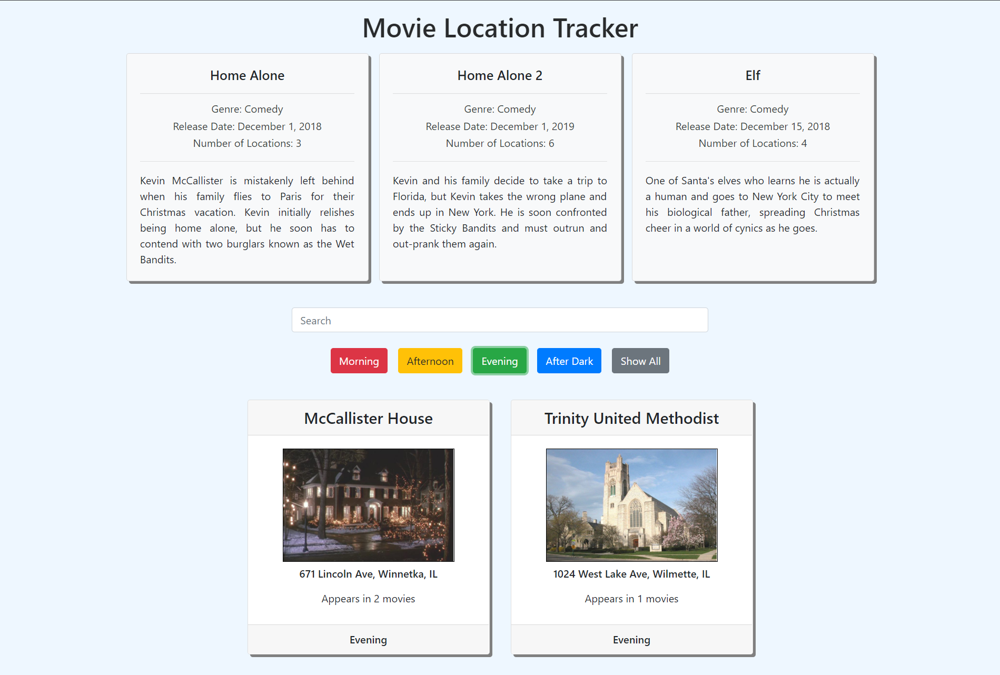
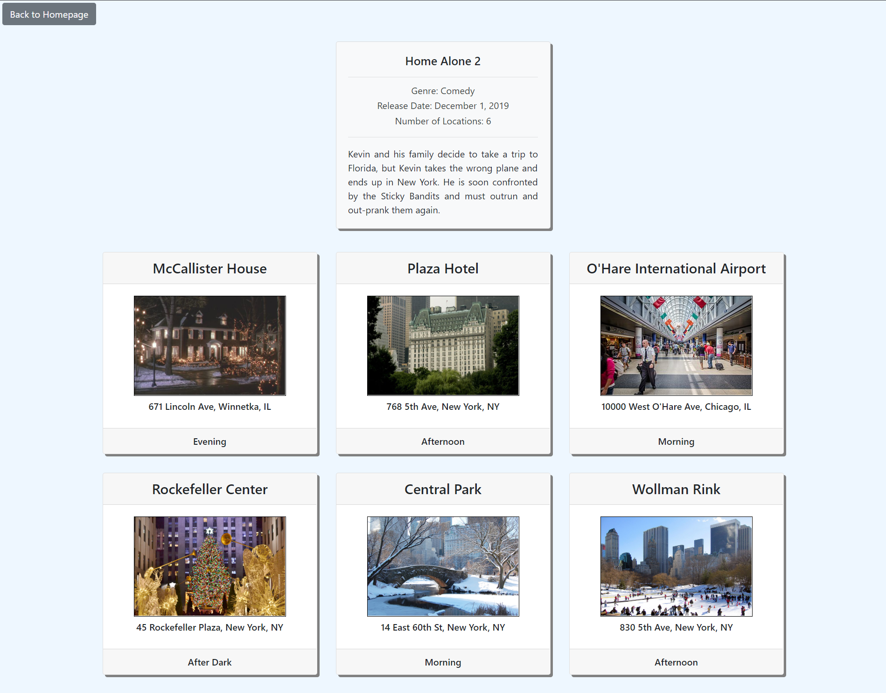

# Movie Location Tracker

### Description
The purpose of this  homework assingment was to introduce us to jQuery and promises. The basic functionality of searching and filtering items are not new. However, using jQuery to search and filter through items was new.

### Requirements
- **All Movies View**
  - As a user, I have successfully completed my first movie and am filming a lot more.  I need to update my app to track all of the various locations for all my movies.
  - Upon arriving at the homepage, I should see a section of cards with information on my movies (it should display all of them).
    - Each movie card should contain the name, genre, estimated release date, description, and the number of shooting locations.
  - Upon arriving at the homepage, I should see a list of ALL locations that ALL of my movies need, displayed as cards.
    - Each location card should show the image, name, address, shoot time, and number of movies that use that location.
  - As a user, I should be displayed a search bar. This search bar should filter the results of the cards. On keypress, the text I type in the search bar should be contained in the location title text, the location address, or one of the movie names of all cards still displayed.
  - As a user, I should be displayed 4 button options for "time of day." (Options: Morning, Afternoon, Evening, After Dark). These buttons should filter the results down to each location that has a "Time That shot should occur" corresponding to the button clicked.

- **Single Location View**
    - As a user, when I click on one of the movie cards, the DOM is completely rewritten (as though I am on a new page). This new DOM should have the info for the single movie I clicked on, cards for the locations for the movie I am currently viewing, and a back button.
    - If I click on the back button, I should then be viewing "All Locations/movies View"

### Technologies Used
* HTML
* CSS
* JavaScript
* Bootstrap
* jQuery

### Screenshots
Homepage View

Search by location name or location address

Filter locations by shoot time

Click on movie to see locations


### How to run application

* Use npm to install http-server in your terminal:
```sh
npm install -g http-server
```
* Run the server in your terminal
```sh
hs -p 9999
```
* Open chrome and navigate to:
```
localhost:9999
```

### Contributors
[Maggie Leavell](https://github.com/mjleavell)